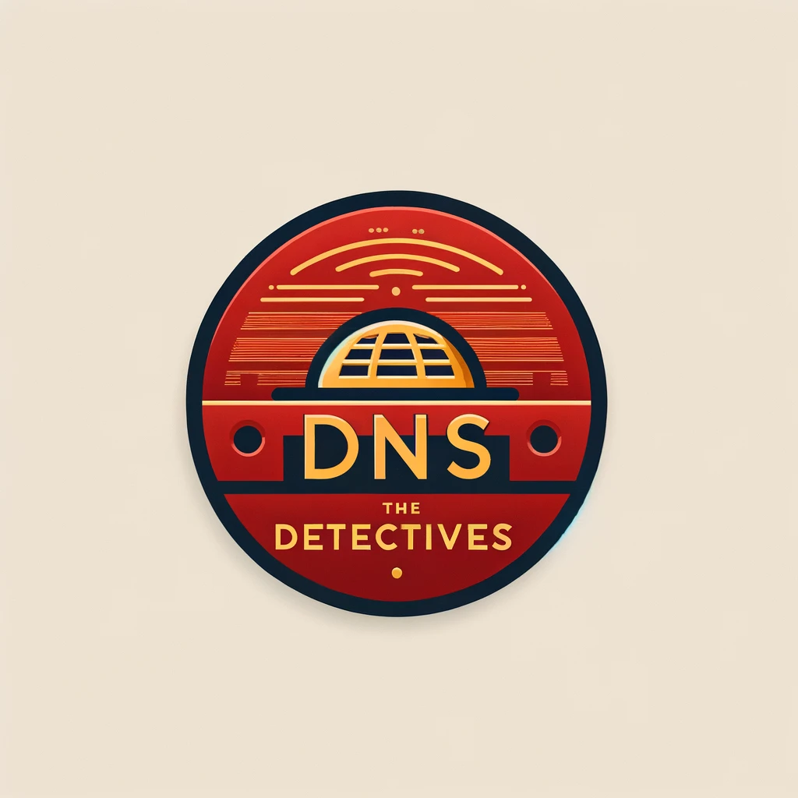
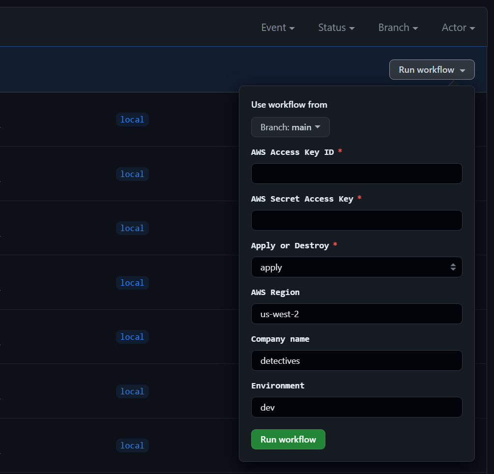
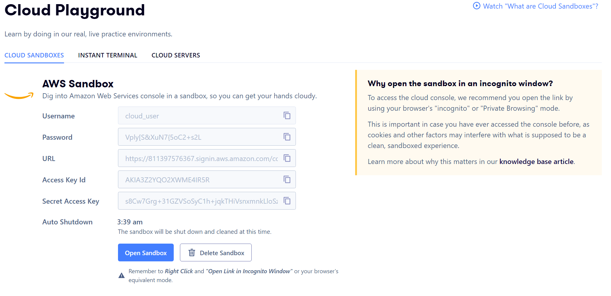
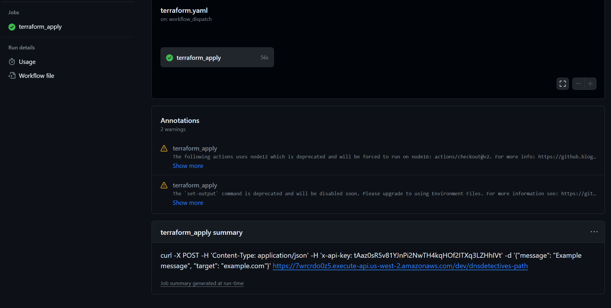
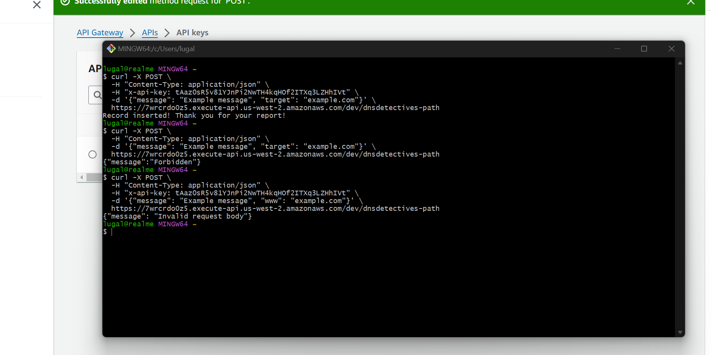
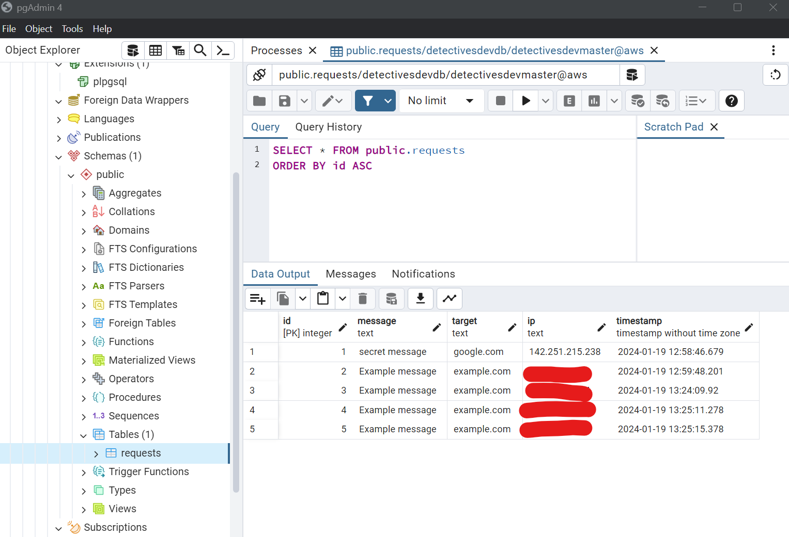

## Overview

This project contains Terraform code for deploying a set of AWS resources, including Lambda functions, RDS instances, API Gateways, and related security and networking configurations. The code is designed to set up these resources efficiently, with a focus on public accessibility and simplicity.

## Description

The solution presented in this codebase is not the final or desired solution, but rather a "refusal to spend more than 5 hours on this" approach. 😄

During the development, the use-case specifics, particularly around who needs access to the API Gateway and how, were not entirely clear. Consequently, the working hypothesis was that the API Gateway needed to be accessible over the public internet. For instance, this is why the clients were not placed in a network using a zero-trust or VPN mesh solution, and why I didn't use a private endpoint API Gateway. The design choices reflect a balance between accessibility, security, and development time constraints.

## Configuration Details

- **IAM Roles and Policies**: Configured to provide necessary permissions to Lambda functions and other services.
- **RDS Instances**: Set up with specific naming conventions and password constraints to meet AWS standards.
- **Lambda Functions**: Deployed with environment variables and VPC configurations.
- **API Gateway**: Configured for public internet access, considering the ambiguous nature of the use-case requirements.
- **VPC and Networking**: Designed for straightforward public accessibility, without intricate zero-trust or VPN-based network configurations.

## Usage

**Step 1.** Start the Deploy/Destroy Terraform GitHub action. You will need to provide the desired AWS region, company name, and environment. It will require your AWS Access Key ID and AWS Secret Access Key for authentication.

For this project, A Cloud Guru's AWS sandbox environment was used, which offers a live environment for up to 3 hours.

**Step 2.** Once Terraform has successfully created the environment, you can find a pre-configured (security-first!) example curl command in the action summary. This command is ready for immediate use to interact with the newly created infrastructure.

## Disclaimer

This project is a demonstration of rapid development in response to ambiguous requirements. It's not intended as a blueprint for production deployments, especially where complex security and networking considerations are paramount.
